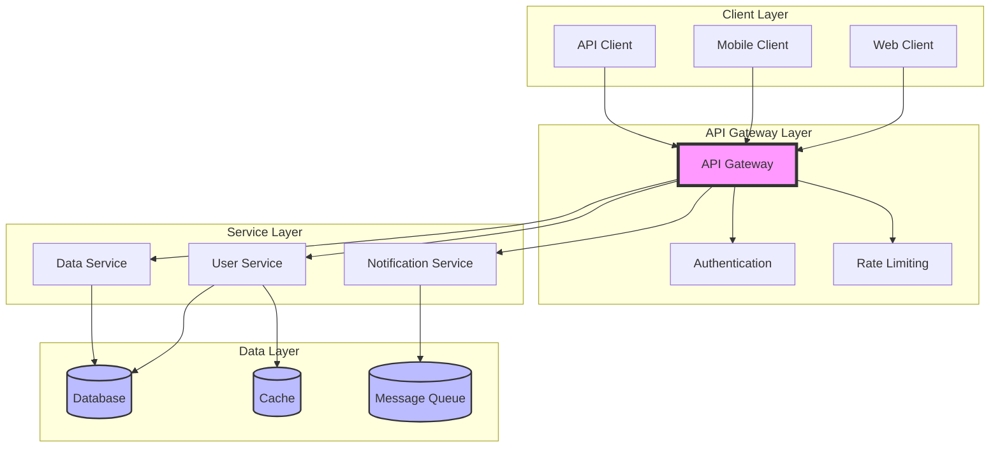
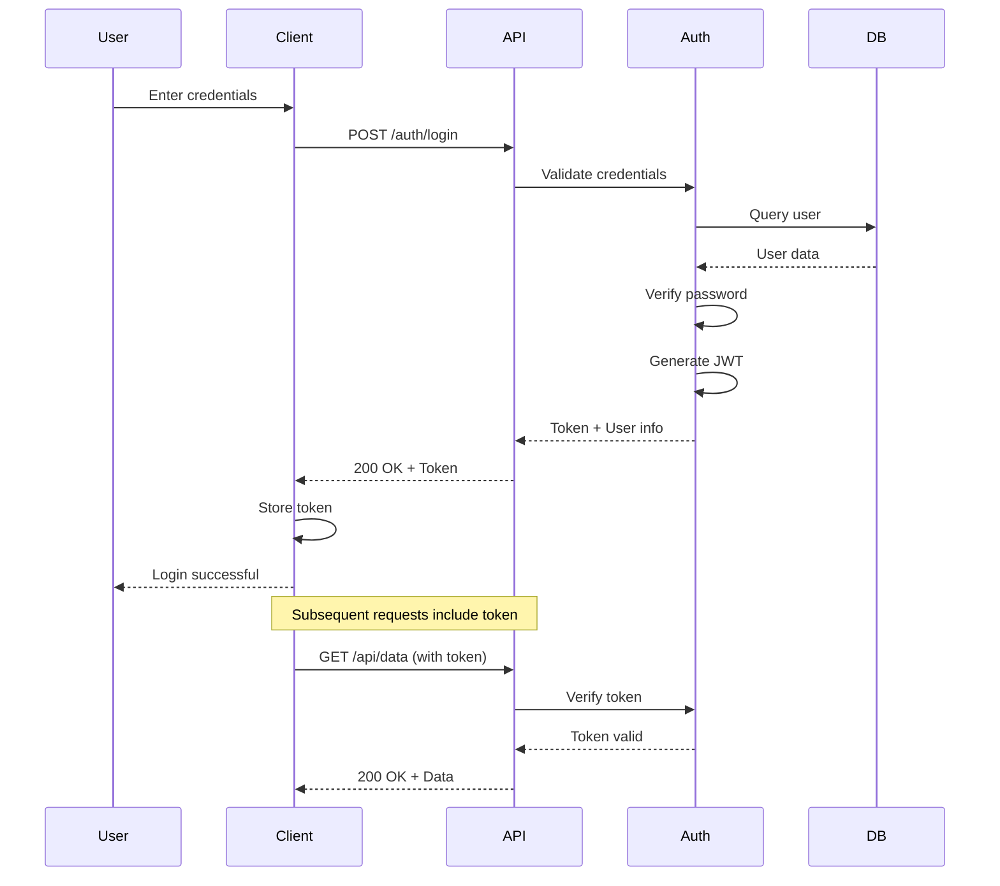
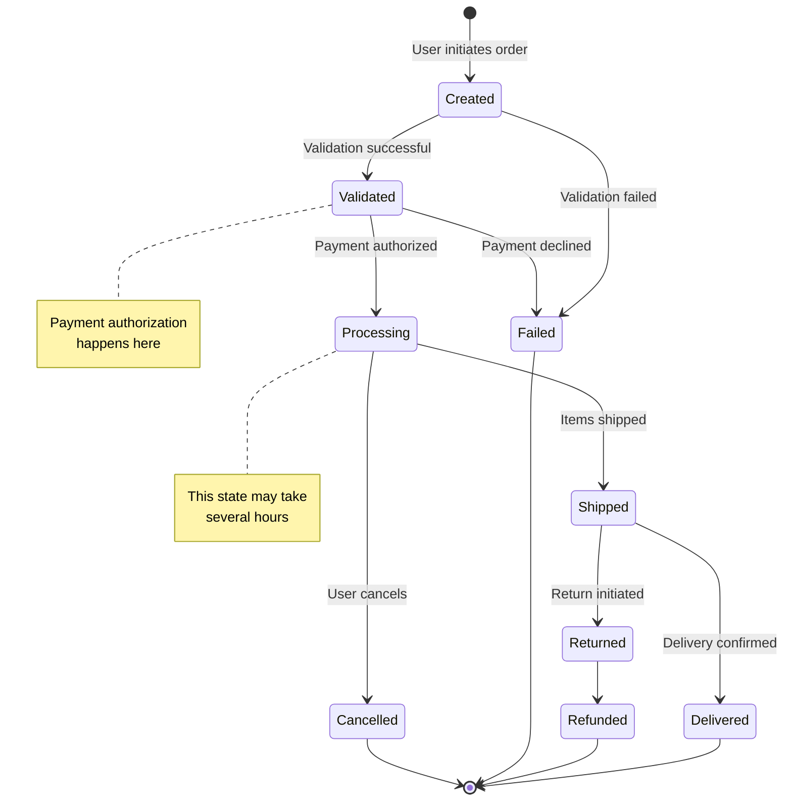
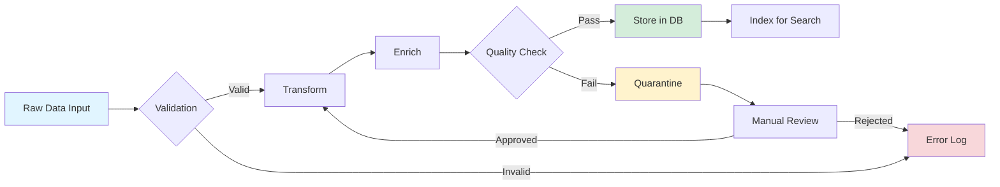
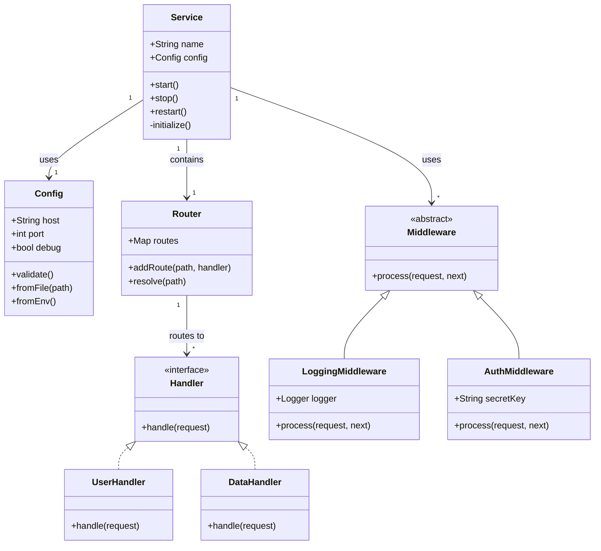

lastmod: 2025-10-11T08:26:39Z

# Framework Documentation Best Practices and Writing Guidelines

This document outlines recommended best practices for creating high-quality technical documentation for framework projects. It covers writing style, content organization, code examples, and tooling to ensure clear, maintainable, and user-friendly documentation.

## 1. Documentation Goals and Principles

### Core Objectives
- **Clarity**: Use clear, concise language accessible to developers of varying skill levels
- **Completeness**: Cover all features, APIs, and common use cases comprehensively
- **Accuracy**: Ensure all code examples are tested and up-to-date with the current framework version
- **Discoverability**: Structure content logically with effective navigation and search capabilities
- **Maintainability**: Keep documentation synchronized with code changes through automation
- **Accessibility**: Ensure documentation is usable by everyone, including those using assistive technologies

### Writing Style Guidelines

#### Voice and Tense
- Use **active voice** and **present tense**: "The function returns..." not "The function will return..."
- Write in **second person** when addressing the reader: "You can configure..." not "One can configure..."
- Use **imperative mood** for instructions: "Install the package" not "You should install the package"

#### Clarity and Concision
- Keep sentences concise and focused on a single concept (aim for 15-25 words per sentence)
- Break complex ideas into shorter paragraphs (3-5 sentences maximum)
- Use bullet points for lists of items, but avoid excessive nesting
- Define technical terms and acronyms on first use
- Use consistent terminology throughout all documentation (maintain a glossary)

#### Language Patterns to Avoid
- ❌ Avoid: "simply", "just", "easily", "obviously" (they minimize difficulty)
- ❌ Avoid: "In order to" (use "to" instead)
- ❌ Avoid: Passive constructions when active is clearer
- ❌ Avoid: Future tense ("will") when describing current functionality
- ❌ Avoid: Gendered pronouns (use "they/their" or rephrase)

#### Language Patterns to Use
- ✅ Use: Specific, actionable verbs ("configure", "initialize", "implement")
- ✅ Use: Concrete examples rather than abstract descriptions
- ✅ Use: Transitions to connect ideas ("however", "additionally", "for example")
- ✅ Use: Parallel structure in lists and headings

## 2. Content Organization and Structure

### Recommended Directory Structure

```
docs/
├── index.md                          # Landing page with overview
├── getting-started/
│   ├── index.md                      # Getting started overview
│   ├── installation.md               # Installation instructions
│   ├── quick-start.md                # 5-minute quick start guide
│   ├── basic-concepts.md             # Core concepts and terminology
│   └── first-project.md              # Building your first project
├── guides/
│   ├── user-guides/
│   │   ├── configuration.md          # Configuration options
│   │   ├── authentication.md         # Auth setup and usage
│   │   ├── data-handling.md          # Working with data
│   │   └── deployment.md             # Deployment strategies
│   └── developer-guides/
│       ├── architecture.md           # System architecture
│       ├── extending.md              # Creating extensions
│       ├── plugin-development.md     # Plugin system
│       └── testing.md                # Testing strategies
├── api-reference/
│   ├── index.md                      # API overview
│   ├── core/
│   │   ├── classes.md                # Core classes
│   │   ├── functions.md              # Utility functions
│   │   └── interfaces.md             # Type definitions
│   ├── extensions/
│   │   └── available-extensions.md   # Extension API docs
│   └── cli/
│       └── commands.md               # CLI command reference
├── examples/
│   ├── index.md                      # Examples overview
│   ├── basic/
│   │   ├── hello-world.md
│   │   └── simple-config.md
│   ├── intermediate/
│   │   ├── custom-middleware.md
│   │   └── database-integration.md
│   └── advanced/
│       ├── microservices.md
│       └── performance-optimization.md
├── tutorials/
│   ├── building-rest-api.md          # Step-by-step tutorials
│   ├── creating-plugin.md
│   └── migrating-from-v1.md
├── architecture/
│   ├── overview.md                   # High-level architecture
│   ├── design-decisions.md           # ADRs (Architecture Decision Records)
│   ├── design-patterns.md            # Patterns used in framework
│   └── diagrams/
│       ├── component-diagram.md
│       └── data-flow.md
├── contributing/
│   ├── index.md                      # Contributing overview
│   ├── guidelines.md                 # Contribution guidelines
│   ├── code-style.md                 # Coding standards
│   ├── documentation-style.md        # This guide
│   ├── testing.md                    # Testing requirements
│   └── pull-request-process.md       # PR workflow
├── migration-guides/
│   ├── v1-to-v2.md                   # Version migration guides
│   └── v2-to-v3.md
├── troubleshooting/
│   ├── common-errors.md              # Common error messages
│   ├── debugging.md                  # Debugging techniques
│   └── faq.md                        # Frequently asked questions
├── changelog/
│   ├── index.md                      # All versions
│   ├── v3.0.0.md                     # Version-specific changes
│   └── v2.5.0.md
└── resources/
    ├── glossary.md                   # Terms and definitions
    ├── external-resources.md         # Useful external links
    └── community.md                  # Community channels

examples/                              # Separate from docs for runnable code
├── python/
│   ├── basic/
│   ├── intermediate/
│   └── advanced/
├── javascript/
│   ├── basic/
│   ├── intermediate/
│   └── advanced/
└── csharp/
    ├── basic/
    ├── intermediate/
    └── advanced/
```

### Document Structure Template

Each documentation page should follow this structure:

```markdown
# [Clear, Descriptive Title]

<!-- Brief one-sentence overview -->
A concise description of what this document covers and who it's intended for.

## Table of Contents (for longer documents)
- [Overview](#overview)
- [Prerequisites](#prerequisites)
- [Basic Usage](#basic-usage)
- [Advanced Usage](#advanced-usage)
- [Examples](#examples)
- [Best Practices](#best-practices)
- [Troubleshooting](#troubleshooting)
- [Related Topics](#related-topics)

## Overview

Detailed introduction explaining:
- The purpose of this feature/concept
- When and why you would use it
- High-level benefits and use cases
- Any important context or background

## Prerequisites

Before following this guide, you should have:
- Required knowledge (with links to learning resources)
- Required software/dependencies installed
- Completed setup steps (with links)
- Familiarity with related concepts (with links)

## Basic Usage

Step-by-step guide demonstrating the most common use case:

1. **Step one**: Description of first action
   ```language
   # Code example
   ```

2. **Step two**: Description of second action
   ```language
   # Code example
   ```

3. **Step three**: Description of third action
   ```language
   # Code example
   ```

Expected result: Describe what the user should see/get.

## Advanced Usage

More complex scenarios and configurations:

### Use Case 1: [Specific Scenario]
Description and example

### Use Case 2: [Another Scenario]
Description and example

## Configuration Options (if applicable)

Detailed explanation of available configuration parameters:

| Parameter | Type | Default | Description |
|-----------|------|---------|-------------|
| `param1` | string | `"default"` | Purpose and usage |
| `param2` | number | `100` | Purpose and usage |

## API Reference (if applicable)

Detailed technical reference with:
- Function signatures
- Parameter descriptions
- Return values
- Type information
- Exception/error information

## Examples

Complete, runnable code examples covering common scenarios:

### Example 1: [Basic Scenario]
```language
# Complete working example with comments
```

### Example 2: [Intermediate Scenario]
```language
# Complete working example with comments
```

## Best Practices

Recommended patterns and approaches:

✅ **Do:**
- Specific recommendation with explanation
- Another recommendation with example

❌ **Don't:**
- Anti-pattern to avoid with explanation
- Another anti-pattern with alternative

## Common Pitfalls

Known issues, gotchas, and how to avoid them:

### Pitfall 1: [Issue Description]
**Problem**: What goes wrong
**Solution**: How to avoid or fix it
**Example**: Code showing the correct approach

## Performance Considerations

Information about performance implications:
- Memory usage patterns
- CPU/IO intensive operations
- Optimization techniques
- Benchmarking results (if applicable)

## Security Considerations

Security-related guidance:
- Authentication/authorization requirements
- Input validation needs
- Sensitive data handling
- Common vulnerabilities to avoid

## Troubleshooting

Common errors and their solutions:

### Error: [Error Message]
**Cause**: Why this error occurs
**Solution**: How to fix it
**Prevention**: How to avoid it in the future

## Related Topics

Links to related documentation:
- [Related Feature 1](link)
- [Related Feature 2](link)
- [Related Guide](link)

## Additional Resources

External resources for further learning:
- Official documentation links
- Tutorial videos
- Blog posts
- Community examples

---
lastmod: 2025-10-11T08:26:39Z

**Last Updated**: YYYY-MM-DD  
**Applies to Version**: X.Y.Z  
**Feedback**: [Link to issue tracker or feedback form]
```

## 3. Code Examples and Snippets

### Code Example Guidelines

#### Essential Elements for All Code Examples

Every code example must include:

1. **Language identification** with syntax highlighting
2. **Complete, runnable code** when possible (not fragments)
3. **Clear comments** explaining key concepts
4. **Expected output** or behavior description
5. **Version compatibility** if version-specific
6. **Error handling** demonstration
7. **Import statements** and dependencies

#### Code Example Template

````markdown
### Example: [Descriptive Title]

Brief explanation of what this example demonstrates and when to use it.

**Prerequisites**: List any setup requirements

```python
# Import required modules
from framework import Config, Service, Exception

# Step 1: Initialize configuration
# This creates a config object with custom settings
config = Config(
    host="localhost",
    port=8080,
    debug=True,  # Enable debug mode for development
    timeout=30   # Connection timeout in seconds
)

# Step 2: Create service instance
try:
    service = Service(config)
    
    # Step 3: Start the service
    service.start()
    
    # Step 4: Perform operation
    result = service.process_data({"key": "value"})
    print(f"Result: {result}")
    
except Exception as e:
    print(f"Error: {e}")
    # Handle error appropriately

# Expected output:
# Server running on http://localhost:8080
# Result: {"status": "success", "data": {...}}
```

**Key Points**:
- Configuration is validated on initialization
- Service.start() is non-blocking by default
- Errors are raised as framework.Exception

**See Also**: [Related Documentation](#)
````

### Multi-Language Support

When documenting a framework that supports multiple languages, provide examples in all supported languages:

````markdown
### Example: Basic Service Initialization

Choose your preferred language:

<tabs groupId="programming-language">
<tabItem value="python" label="Python" default>

```python
from framework import Service

# Create and configure service
service = Service(
    host="localhost",
    port=8080
)

# Start the service
service.start()
```

</tabItem>
<tabItem value="javascript" label="JavaScript">

```javascript
const { Service } = require('framework');

// Create and configure service
const service = new Service({
  host: 'localhost',
  port: 8080
});

// Start the service
service.start();
```

</tabItem>
<tabItem value="csharp" label="C#">

```csharp
using Framework;

// Create and configure service
var service = new Service
{
    Host = "localhost",
    Port = 8080
};

// Start the service
service.Start();
```

</tabItem>
</tabs>

**Note**: All examples produce the same behavior across languages.
````

### Code Snippet Best Practices

#### Do's
✅ **Keep snippets focused**: Show only relevant code for the concept being explained
✅ **Use realistic examples**: Avoid foo/bar; use domain-appropriate variable names
✅ **Include error handling**: Show proper exception/error management patterns
✅ **Test all examples**: Ensure every code snippet actually works with current version
✅ **Provide context**: Explain what the code does before showing it
✅ **Show complete imports**: Include all necessary import/using/require statements
✅ **Use consistent formatting**: Follow the language's standard style guide
✅ **Add inline comments**: Explain non-obvious code sections

#### Don'ts
❌ **Don't show incomplete code**: Unless explicitly marked as "partial example"
❌ **Don't use outdated syntax**: Keep examples current with latest framework version
❌ **Don't skip error handling**: Always show proper exception handling
❌ **Don't use magic numbers**: Use named constants or explain numeric values
❌ **Don't assume context**: Each example should be self-contained
❌ **Don't mix concerns**: Keep examples focused on one concept at a time

### Code Example Categories

#### 1. Quick Reference Examples
Short, focused snippets for API documentation:

```python
# Quick example: Creating a configuration
config = Config(host="localhost", port=8080)
```

#### 2. Tutorial Examples
Step-by-step examples for learning:

```python
# Tutorial: Building your first service

# Step 1: Import the framework
from framework import Service, Config

# Step 2: Create configuration
config = Config()
config.set_host("localhost")
config.set_port(8080)

# Step 3: Initialize service
service = Service(config)

# Step 4: Define request handler
@service.route("/hello")
def hello_handler(request):
    return {"message": "Hello, World!"}

# Step 5: Start the service
if __name__ == "__main__":
    service.start()
```

#### 3. Real-World Examples
Complete, production-like examples:

```python
# Real-world example: Production service with logging, error handling, and graceful shutdown

import logging
from framework import Service, Config, ServiceException
from framework.middleware import AuthMiddleware, LoggingMiddleware

# Configure logging
logging.basicConfig(level=logging.INFO)
logger = logging.getLogger(__name__)

# Load configuration from environment
config = Config.from_env()

# Add middleware
service = Service(config)
service.use(LoggingMiddleware())
service.use(AuthMiddleware(secret_key=config.auth_secret))

# Define routes
@service.route("/api/users")
async def get_users(request):
    try:
        users = await database.get_users()
        return {"users": users}
    except Exception as e:
        logger.error(f"Failed to fetch users: {e}")
        raise ServiceException("Failed to retrieve users", status_code=500)

# Graceful shutdown
def shutdown_handler(signal, frame):
    logger.info("Shutting down gracefully...")
    service.stop()
    sys.exit(0)

signal.signal(signal.SIGINT, shutdown_handler)
signal.signal(signal.SIGTERM, shutdown_handler)

# Start service
if __name__ == "__main__":
    try:
        logger.info("Starting service...")
        service.start()
    except Exception as e:
        logger.critical(f"Failed to start service: {e}")
        sys.exit(1)
```

### Testing Code Examples

All code examples should be automatically tested. Create a test file structure:

```python
# tests/docs/test_examples.py

import pytest
import subprocess
import os

def test_example_files():
    """Test that all Python examples in docs execute without errors"""
    example_dir = "docs/examples/python"
    
    for root, dirs, files in os.walk(example_dir):
        for file in files:
            if file.endswith(".py"):
                file_path = os.path.join(root, file)
                result = subprocess.run(
                    ["python", file_path],
                    capture_output=True,
                    text=True,
                    timeout=30
                )
                assert result.returncode == 0, \
                    f"Example {file_path} failed: {result.stderr}"
```

## 4. API Reference Documentation

### Function/Method Documentation Template

Use this template for documenting functions and methods:

````markdown
### `functionName(parameter1, parameter2, **options)`

<span class="badge badge--success">Added in v2.0</span>
<span class="badge badge--warning">Deprecated in v3.0</span>

Brief one-line description of what the function does (under 80 characters).

Detailed explanation of the function's purpose, behavior, and when to use it. Include any important context, such as:
- What problem it solves
- Common use cases
- Relationship to other functions

#### Parameters

| Parameter | Type | Required | Default | Description |
|-----------|------|----------|---------|-------------|
| `parameter1` | `string` | Yes | - | Description of the parameter and its purpose. Include validation rules and constraints. |
| `parameter2` | `number` | No | `100` | Description of optional parameter. Explain when to use non-default values. |
| `**options` | `dict` | No | `{}` | Additional options object |

**Options Object**:

| Option | Type | Default | Description |
|--------|------|---------|-------------|
| `timeout` | `number` | `30` | Request timeout in seconds |
| `retry` | `boolean` | `false` | Enable automatic retries |

#### Returns

**Type**: `Promise<ResultObject>`

Returns a result object containing:

```typescript
{
  status: 'success' | 'error',
  data: any,
  metadata: {
    timestamp: string,
    duration: number
  }
}
```

#### Raises/Throws

| Exception | When | How to Handle |
|-----------|------|---------------|
| `ValueError` | When parameter1 is empty or invalid format | Validate input before calling |
| `TimeoutError` | When operation exceeds timeout | Increase timeout or check connectivity |
| `AuthenticationError` | When credentials are invalid | Verify authentication configuration |

#### Example

**Basic Usage**:
```python
from framework import functionName

# Simple example with required parameters
result = functionName("input-value", 42)
print(result.status)  # Output: 'success'
```

**Advanced Usage**:
```python
# Using optional parameters and error handling
try:
    result = functionName(
        "input-value",
        150,
        timeout=60,
        retry=True
    )
    
    if result.status == 'success':
        print(f"Operation completed in {result.metadata.duration}ms")
    else:
        print(f"Operation failed: {result.data}")
        
except TimeoutError:
    print("Operation timed out, trying with longer timeout")
    result = functionName("input-value", 150, timeout=120)
```

#### Performance Notes

- Time Complexity: O(n log n) where n is the size of parameter1
- Space Complexity: O(n)
- Average execution time: 50-100ms for typical inputs
- Consider using batch operations for processing >1000 items

#### Security Considerations

- Parameter1 is sanitized to prevent injection attacks
- Sensitive data in parameter2 is not logged
- Results may contain PII and should be handled according to privacy policies

#### See Also

- [`relatedFunction()`](#relatedfunction) - Similar functionality for different use case
- [Configuration Guide](../guides/configuration.md) - Setting up function behavior
- [Examples: Advanced Usage](../examples/advanced.md#function-examples)

#### Version History

- **v3.0**: Added `retry` option to options parameter
- **v2.5**: Improved performance for large datasets
- **v2.0**: Initial implementation
````

### Class Documentation Template

````markdown
## ClassName

<span class="badge badge--primary">Core API</span>
<span class="badge badge--success">Added in v1.0</span>

Brief description of the class purpose and its role in the framework.

Detailed explanation including:
- What this class represents or manages
- Key responsibilities and capabilities
- When to use this class vs alternatives
- Typical usage patterns

### Inheritance Hierarchy

```
BaseClass
  └─ ParentClass
      └─ ClassName
```

### Constructor

#### `ClassName(config, options)`

Creates a new instance of ClassName.

**Parameters**:

| Parameter | Type | Required | Default | Description |
|-----------|------|----------|---------|-------------|
| `config` | `Config` | Yes | - | Configuration object for the instance |
| `options` | `dict` | No | `{}` | Additional options |

**Example**:
```python
from framework import ClassName, Config

config = Config(host="localhost", port=8080)
instance = ClassName(config, options={"debug": True})
```

### Properties

#### `property1` (read-only)
**Type**: `string`

Description of what this property represents and when to use it.

```python
value = instance.property1
print(value)  # Output: "example"
```

#### `property2` (read-write)
**Type**: `number`  
**Default**: `100`

Description of this property, including:
- Valid value ranges
- What happens when changed
- Performance implications

```python
# Get current value
current = instance.property2

# Set new value (triggers validation)
instance.property2 = 200
```

### Methods

#### Instance Methods

##### `methodName(parameter)`

Brief description of what this method does.

**Parameters**:
- `parameter` (Type): Description

**Returns**: `ReturnType` - Description

**Example**:
```python
result = instance.methodName("value")
```

[See detailed documentation](#methodname-detailed)

##### `anotherMethod()`

Brief description.

[See detailed documentation](#anothermethod-detailed)

#### Static Methods

##### `ClassName.staticMethod(param)`

Brief description of this static method.

**Usage**:
```python
result = ClassName.staticMethod("value")
```

### Events (if applicable)

The class emits the following events:

#### `event-name`

Emitted when [condition occurs].

**Event Data**:
```typescript
{
  source: ClassName,
  timestamp: string,
  data: any
}
```

**Example**:
```python
def handle_event(event):
    print(f"Event received: {event.data}")

instance.on('event-name', handle_event)
```

### Complete Example

**Basic Usage**:
```python
from framework import ClassName, Config

# Initialize
config = Config.from_file("config.json")
instance = ClassName(config)

# Configure properties
instance.property2 = 150

# Use methods
result = instance.methodName("input")
print(result)

# Handle events
instance.on('event-name', lambda e: print(e.data))

# Cleanup
instance.dispose()
```

**Advanced Usage**:
```python
from framework import ClassName, Config
import asyncio

class CustomClass(ClassName):
    """Extend ClassName with custom behavior"""
    
    def __init__(self, config):
        super().__init__(config)
        self.custom_data = []
    
    async def custom_method(self):
        """Add custom functionality"""
        result = await self.methodName("async-input")
        self.custom_data.append(result)
        return result

async def main():
    config = Config(host="localhost")
    instance = CustomClass(config)
    
    result = await instance.custom_method()
    print(f"Custom result: {result}")

asyncio.run(main())
```

### Best Practices

✅ **Do**:
- Initialize with valid configuration
- Handle events for important state changes
- Call dispose() when done to free resources
- Use async methods in async contexts

❌ **Don't**:
- Create multiple instances with same config (use singleton pattern)
- Modify internal state directly (use provided methods)
- Ignore error events

### Common Issues

**Issue**: Instance fails to initialize  
**Cause**: Invalid configuration  
**Solution**: Validate config with `Config.validate()` before passing to constructor

### Related Classes

- [`Config`](#config) - Configuration management
- [`BaseClass`](#baseclass) - Parent class with shared functionality
- [`RelatedClass`](#relatedclass) - Used in conjunction with ClassName

### Version History

- **v2.0**: Added async support for methodName
- **v1.5**: Added property2 for configuration
- **v1.0**: Initial implementation
````

## 5. Diagrams and Visual Aids

### When to Use Diagrams

Use diagrams to illustrate:
- **Architecture overviews**: System components and their relationships
- **Data flow**: How data moves through the system
- **State machines**: State transitions and conditions
- **Class hierarchies**: Inheritance and composition relationships
- **Sequence diagrams**: Interaction between components over time
- **Decision trees**: Conditional logic and branching
- **Network topologies**: Distributed system layouts
- **Process flows**: Step-by-step workflows

### Diagram Best Practices

✅ **Do**:
- Keep diagrams simple and focused on one concept
- Use consistent colors and shapes throughout documentation
- Provide both diagram and text explanation
- Include legends for symbols and colors
- Make diagrams accessible (alt text, high contrast)
- Use standard notation (UML, C4, etc.)

❌ **Don't**:
- Create overly complex diagrams with too many elements
- Use decorative elements that don't convey information
- Rely solely on color to convey meaning
- Create diagrams without accompanying text explanation

### Mermaid Diagram Examples

#### Architecture Diagram

````markdown
### System Architecture

The framework follows a layered architecture with clear separation of concerns:



**Key Components**:
- **API Gateway**: Central entry point handling authentication and rate limiting
- **Services**: Independent microservices with specific responsibilities
- **Data Layer**: Persistent storage, caching, and message queuing
````

#### Sequence Diagram

````markdown
### Authentication Flow

This diagram shows the complete authentication process:



**Process Steps**:
1. User submits credentials through client
2. API forwards to authentication service
3. Authentication service validates against database
4. JWT token is generated and returned
5. Client stores token for subsequent requests
6. All API requests include the token for authentication
````

#### State Machine Diagram

````markdown
### Order State Machine

Orders transition through the following states:



**State Descriptions**:
- **Created**: Initial state when order is placed
- **Validated**: Order passed all validation checks
- **Processing**: Payment processed, preparing for shipment
- **Shipped**: Order dispatched to customer
- **Delivered**: Order received by customer
- **Failed**: Order failed validation or payment
- **Cancelled**: User cancelled the order
- **Returned**: Customer initiated a return
- **Refunded**: Refund processed
````

#### Data Flow Diagram

````markdown
### Data Processing Pipeline



**Pipeline Stages**:
1. **Input**: Data received from external sources
2. **Validation**: Schema and business rule validation
3. **Transform**: Convert to internal format
4. **Enrich**: Add additional context and metadata
5. **Quality Check**: Verify data quality metrics
6. **Storage**: Persist to database
7. **Indexing**: Make searchable
8. **Error Handling**: Failed data goes to error log or quarantine
````

#### Class Diagram

````markdown
### Core Class Relationships



**Relationship Types**:
- **Composition** (filled diamond): Service contains Router
- **Association** (line): Service uses Config and Middleware
- **Implementation** (dashed line): Concrete classes implement Handler interface
- **Inheritance** (hollow arrow): Middleware subclasses inherit from Middleware
````

### External Diagram Tools

For complex diagrams that Mermaid cannot handle:

#### Using Draw.io
1. Create diagram in draw.io
2. Export as SVG with embedded text
3. Save to `docs/diagrams/` directory
4. Reference in markdown:

```markdown


[Edit this diagram](./diagrams/architecture.drawio)
```

#### Using PlantUML
1. Create `.puml` file in `docs/diagrams/`
2. Generate PNG/SVG using PlantUML
3. Commit both source and generated image

```markdown


<details>
<summary>View PlantUML source</summary>

\`\`\`plantuml
@startuml
!include <C4/C4_Container>
...
@enduml
\`\`\`
</details>
```

### Accessibility for Diagrams

Always include:

1. **Alt text** describing the diagram's content
2. **Text description** explaining key information
3. **High contrast** colors (avoid red/green only)
4. **Labels** on all elements
5. **Legend** explaining symbols and colors

Example:
```markdown


The architecture consists of three primary layers:
- **Client Layer**: Web browsers and mobile applications
- **Service Layer**: Independent microservices (User, Data, Notification)
- **Data Layer**: PostgreSQL database and Redis cache
```

## 6. Common Pitfalls and Anti-Patterns

### Documentation Anti-Patterns to Avoid

#### 1. Outdated Examples

❌ **Problem**:
```python
# This no longer works in v3.0
service = Service(host="localhost", port=8080)  # Deprecated syntax
```

✅ **Solution**:
```python
# Current syntax as of v3.0
config = Config(host="localhost", port=8080)
service = Service(config)  # Use Config object
```

**Prevention**: 
- Automate testing of all code examples
- Add version badges to examples
- Run documentation tests in CI/CD

#### 2. Assuming Too Much Knowledge

❌ **Problem**:
"Simply configure the OAuth2 flow with PKCE."

✅ **Solution**:
"Configure the OAuth2 authorization code flow with PKCE (Proof Key for Code Exchange). PKCE is a security extension that prevents authorization code interception. [Learn more about OAuth2 and PKCE](link)."

#### 3. Incomplete Examples

❌ **Problem**:
```python
# Incomplete - where does 'data' come from?
result = process(data)
```

✅ **Solution**:
```python
# Complete example with setup
from framework import process

# Sample data for demonstration
data = {
    "user_id": "123",
    "action": "update",
    "payload": {"name": "John Doe"}
}

# Process the data
result = process(data)
print(f"Result: {result}")
```

#### 4. Vague Language

❌ **Problem**:
"This function is fast and efficient."

✅ **Solution**:
"This function processes 10,000 records per second on average hardware (4-core CPU, 8GB RAM) with O(n log n) time complexity."

#### 5. Missing Error Handling

❌ **Problem**:
```python
response = api.call(endpoint)
data = response.json()
```

✅ **Solution**:
```python
try:
    response = api.call(endpoint)
    response.raise_for_status()  # Raises HTTPError for bad status
    data = response.json()
except requests.HTTPError as e:
    print(f"HTTP error occurred: {e}")
except requests.RequestException as e:
    print(f"Request failed: {e}")
except ValueError as e:
    print(f"Invalid JSON response: {e}")
```

#### 6. Over-Complicated Examples

❌ **Problem**:
300-line example showing basic configuration mixed with advanced features

✅ **Solution**:
Separate into:
- **Basic example** (10-20 lines): Core functionality
- **Intermediate example** (50-100 lines): Common enhancements
- **Advanced example** (100+ lines): Production-ready with all features

#### 7. No Context or Use Case

❌ **Problem**:
```python
# Random code without explanation
service.enable_feature_x()
```

✅ **Solution**:
```python
# Enable feature X for handling large file uploads
# This increases the max upload size from 10MB to 100MB
# Use this when your application needs to process large media files
service.enable_feature_x()
```

### Common Documentation Issues

#### Issue 1: Documentation Drift

**Problem**: Documentation doesn't match current code behavior

**Causes**:
- Code updated without updating docs
- Missing documentation review in PR process
- No automated verification of examples

**Solutions**:
```yaml
# .github/workflows/docs-validation.yml
name: Validate Documentation

on: [pull_request]

jobs:
  validate-docs:
    runs-on: ubuntu-latest
    steps:
      - uses: actions/checkout@v3
      
      - name: Check for modified code without doc updates
        run: |
          # If src/ changed, ensure docs/ was also changed
          if git diff --name-only origin/main | grep "^src/"; then
            if ! git diff --name-only origin/main | grep "^docs/"; then
              echo "Error: Code changes detected without documentation updates"
              exit 1
            fi
          fi
      
      - name: Test all documentation examples
        run: |
          python tests/test_doc_examples.py
      
      - name: Check for broken links
        run: |
          npm install -g markdown-link-check
          find docs -name "*.md" -exec markdown-link-check {} \;
```

#### Issue 2: Inconsistent Terminology

**Problem**: Same concept called different names in different places

**Solution**: Create and maintain a glossary

```markdown
# docs/resources/glossary.md

## Glossary

### Service
**Preferred term**: Service  
**Avoid**: Server, Daemon, Worker  
**Definition**: A long-running process that handles requests

### Configuration
**Preferred term**: Configuration  
**Avoid**: Config, Settings, Options (use consistently)  
**Definition**: Parameters that control service behavior

### Handler
**Preferred term**: Handler  
**Avoid**: Controller, Processor  
**Definition**: A function that processes a specific type of request
```

Enforce with automated checks:
```python
# scripts/check_terminology.py
import re
import sys

DISCOURAGED_TERMS = {
    "config": "configuration",
    "configs": "configurations",
    "server": "service",
}

def check_file(filepath):
    with open(filepath) as f:
        content = f.read()
        issues = []
        
        for wrong, correct in DISCOURAGED_TERMS.items():
            pattern = r'\b' + wrong + r'\b'
            if re.search(pattern, content, re.IGNORECASE):
                issues.append(f"Use '{correct}' instead of '{wrong}'")
        
        return issues

# Run on all markdown files
```

#### Issue 3: Poor Discoverability

**Problem**: Users can't find relevant documentation

**Solutions**:

1. **Clear navigation structure**:
```markdown
# docs/index.md

## Documentation by Role

### I'm new to the framework
- [Quick Start Guide](getting-started/quick-start.md)
- [Basic Concepts](getting-started/basic-concepts.md)
- [Your First Project](getting-started/first-project.md)

### I'm building a feature
- [User Guides](guides/user-guides/)
- [Code Examples](examples/)
- [API Reference](api-reference/)

### I'm troubleshooting an issue
- [Troubleshooting Guide](troubleshooting/)
- [Common Errors](troubleshooting/common-errors.md)
- [FAQ](troubleshooting/faq.md)

### I want to contribute
- [Contributing Guidelines](contributing/)
- [Development Setup](contributing/dev-setup.md)
```

2. **Effective search configuration**:
```javascript
// docusaurus.config.js
module.exports = {
  themeConfig: {
    algolia: {
      appId: 'YOUR_APP_ID',
      apiKey: 'YOUR_API_KEY',
      indexName: 'framework_docs',
      contextualSearch: true,
      searchParameters: {
        facetFilters: ['version:VERSION'],
      },
    },
  },
};
```

3. **Cross-referencing**:
```markdown
When discussing feature X, always link to:
- Related features
- Prerequisites
- Advanced usage
- API reference

Example:
Authentication is handled by the [AuthMiddleware](../api-reference/middleware.md#authmiddleware).
See [Authentication Guide](./authentication.md) for detailed setup instructions.
```

#### Issue 4: No Version Management

**Problem**: Documentation doesn't indicate which version it applies to

**Solutions**:

1. **Version badges**:
```markdown
<span class="badge badge--success">Added in v2.0</span>
<span class="badge badge--warning">Deprecated in v3.0</span>
<span class="badge badge--danger">Removed in v4.0</span>
```

2. **Version-specific docs**:
```
docs/
├── v3/
│   ├── getting-started/
│   └── api-reference/
├── v2/
│   ├── getting-started/
│   └── api-reference/
└── version-manifest.json
```

3. **Version selector**:
```javascript
// Docusaurus configuration
module.exports = {
  themeConfig: {
    navbar: {
      items: [
        {
          type: 'docsVersionDropdown',
          position: 'left',
          dropdownActiveClassDisabled: true,
        },
      ],
    },
  },
};
```

## 7. Tooling and Automation

### Recommended Documentation Stack

#### Static Site Generators

Choose based on your needs:

| Tool | Best For | Language | Key Features |
|------|----------|----------|--------------|
| **Docusaurus** | Modern framework docs | JavaScript/React | Versioning, i18n, search, MDX |
| **MkDocs** | Python projects | Python | Simple, Material theme, plugins |
| **Sphinx** | API-heavy docs | Python | Auto-documentation, extensions |
| **VuePress** | Vue-based projects | JavaScript/Vue | Vue components in docs |
| **Jekyll** | GitHub Pages | Ruby | GitHub integration, simple |

#### Docusaurus Configuration Example

```javascript
// docusaurus.config.js
module.exports = {
  title: 'Framework Documentation',
  tagline: 'Build amazing applications',
  url: 'https://docs.example.com',
  baseUrl: '/',
  
  presets: [
    [
      '@docusaurus/preset-classic',
      {
        docs: {
          sidebarPath: require.resolve('./sidebars.js'),
          editUrl: 'https://github.com/org/repo/edit/main/',
          showLastUpdateTime: true,
          showLastUpdateAuthor: true,
          versions: {
            current: {
              label: '3.0 (Current)',
            },
          },
        },
        theme: {
          customCss: require.resolve('./src/css/custom.css'),
        },
      },
    ],
  ],
  
  themeConfig: {
    navbar: {
      title: 'Framework',
      logo: {
        alt: 'Framework Logo',
        src: 'img/logo.svg',
      },
      items: [
        {
          type: 'doc',
          docId: 'getting-started/index',
          position: 'left',
          label: 'Docs',
        },
        {
          type: 'doc',
          docId: 'api-reference/index',
          position: 'left',
          label: 'API',
        },
        {
          to: '/examples',
          label: 'Examples',
          position: 'left',
        },
        {
          type: 'docsVersionDropdown',
          position: 'right',
        },
        {
          href: 'https://github.com/org/repo',
          label: 'GitHub',
          position: 'right',
        },
      ],
    },
    
    footer: {
      style: 'dark',
      links: [
        {
          title: 'Documentation',
          items: [
            {
              label: 'Getting Started',
              to: '/docs/getting-started',
            },
            {
              label: 'API Reference',
              to: '/docs/api-reference',
            },
          ],
        },
        {
          title: 'Community',
          items: [
            {
              label: 'Discord',
              href: 'https://discord.gg/example',
            },
            {
              label: 'Stack Overflow',
              href: 'https://stackoverflow.com/questions/tagged/framework',
            },
          ],
        },
      ],
      copyright: `Copyright © ${new Date().getFullYear()} Framework Project`,
    },
    
    prism: {
      theme: require('prism-react-renderer/themes/github'),
      darkTheme: require('prism-react-renderer/themes/dracula'),
      additionalLanguages: ['python', 'csharp', 'bash', 'json'],
    },
    
    algolia: {
      appId: 'YOUR_APP_ID',
      apiKey: 'YOUR_SEARCH_API_KEY',
      indexName: 'framework_docs',
    },
  },
};
```

### Documentation Linting

#### Markdown Linting

```json
// .markdownlint.json
{
  "default": true,
  "MD001": true,
  "MD003": { "style": "atx" },
  "MD004": { "style": "dash" },
  "MD007": { "indent": 2 },
  "MD013": false,
  "MD024": { "siblings_only": true },
  "MD033": false,
  "MD041": false
}
```

Run with:
```bash
markdownlint '**/*.md' --ignore node_modules
```

#### Vale Prose Linting

```yaml
# .vale.ini
StylesPath = .vale/styles
MinAlertLevel = suggestion

[*.md]
BasedOnStyles = write-good, proselint
```

```yaml
# .vale/styles/FrameworkVocab/Terms.yml
extends: substitution
message: "Use '%s' instead of '%s'"
level: error
ignorecase: true
swap:
  config: configuration
  configs: configurations
  server: service
  servers: services
```

Run with:
```bash
vale docs/
```

### API Documentation Generation

#### Python (Sphinx)

```python
# docs/conf.py
import os
import sys
sys.path.insert(0, os.path.abspath('../src'))

extensions = [
    'sphinx.ext.autodoc',
    'sphinx.ext.napoleon',
    'sphinx.ext.viewcode',
    'sphinx.ext.intersphinx',
    'myst_parser',
]

autodoc_default_options = {
    'members': True,
    'member-order': 'bysource',
    'special-members': '__init__',
    'undoc-members': True,
}

napoleon_google_docstring = True
napoleon_numpy_docstring = False
```

Generate with:
```bash
sphinx-apidoc -o docs/api-reference src/
sphinx-build -b html docs docs/_build
```

#### JavaScript (JSDoc)

```javascript
/**
 * Process data with specified configuration
 * 
 * @param {Object} data - The input data to process
 * @param {string} data.id - Unique identifier
 * @param {string} data.type - Data type
 * @param {Object} options - Processing options
 * @param {number} [options.timeout=30] - Timeout in seconds
 * @param {boolean} [options.retry=false] - Enable retries
 * @returns {Promise<ProcessResult>} Processing result
 * @throws {ValidationError} If data is invalid
 * @throws {TimeoutError} If processing exceeds timeout
 * 
 * @example
 * const result = await process(
 *   { id: '123', type: 'user' },
 *   { timeout: 60 }
 * );
 */
async function process(data, options = {}) {
  // Implementation
}
```

Generate with:
```bash
jsdoc -c jsdoc.json -r src/ -d docs/api-reference
```

#### C# (DocFX)

```csharp
/// <summary>
/// Processes data with the specified configuration
/// </summary>
/// <param name="data">The input data to process</param>
/// <param name="options">Processing options</param>
/// <returns>A task representing the asynchronous operation, containing the processing result</returns>
/// <exception cref="ValidationException">Thrown when data is invalid</exception>
/// <exception cref="TimeoutException">Thrown when processing exceeds timeout</exception>
/// <example>
/// <code>
/// var result = await processor.ProcessAsync(
///     data: new InputData { Id = "123", Type = "user" },
///     options: new ProcessOptions { Timeout = 60 }
/// );
/// </code>
/// </example>
public async Task<ProcessResult> ProcessAsync(InputData data, ProcessOptions options = null)
{
    // Implementation
}
```

Generate with:
```bash
docfx init
docfx build
docfx serve
```

### Automated Testing of Documentation

#### Test Python Examples

```python
# tests/docs/test_python_examples.py
import pytest
import subprocess
import os
from pathlib import Path

EXAMPLES_DIR = Path("docs/examples/python")

def get_python_examples():
    """Find all Python example files"""
    return list(EXAMPLES_DIR.rglob("*.py"))

@pytest.mark.parametrize("example_file", get_python_examples())
def test_example_runs(example_file):
    """Test that Python example executes without errors"""
    result = subprocess.run(
        ["python", str(example_file)],
        capture_output=True,
        text=True,
        timeout=30,
        cwd=example_file.parent
    )
    
    assert result.returncode == 0, (
        f"Example {example_file.name} failed:\n"
        f"STDOUT: {result.stdout}\n"
        f"STDERR: {result.stderr}"
    )

def test_example_output():
    """Test that example produces expected output"""
    example = EXAMPLES_DIR / "basic" / "hello.py"
    result = subprocess.run(
        ["python", str(example)],
        capture_output=True,
        text=True
    )
    
    assert "Hello, Framework!" in result.stdout
```

#### Extract and Test Code Blocks from Markdown

```python
# tests/docs/test_markdown_code_blocks.py
import re
import subprocess
import tempfile
from pathlib import Path

def extract_code_blocks(markdown_file, language):
    """Extract code blocks of specific language from markdown"""
    with open(markdown_file) as f:
        content = f.read()
    
    pattern = rf'```{language}\n(.*?)```'
    blocks = re.findall(pattern, content, re.DOTALL)
    return blocks

def test_python_code_blocks():
    """Test all Python code blocks in documentation"""
    docs_dir = Path("docs")
    
    for md_file in docs_dir.rglob("*.md"):
        code_blocks = extract_code_blocks(md_file, "python")
        
        for i, code in enumerate(code_blocks):
            # Skip non-executable examples (marked with # doctest: +SKIP)
            if "# doctest: +SKIP" in code:
                continue
            
            # Create temporary file and run
            with tempfile.NamedTemporaryFile(mode='w', suffix='.py', delete=False) as f:
                f.write(code)
                temp_path = f.name
            
            try:
                result = subprocess.run(
                    ["python", temp_path],
                    capture_output=True,
                    text=True,
                    timeout=10
                )
                
                assert result.returncode == 0, (
                    f"Code block {i} in {md_file} failed:\n{result.stderr}"
                )
            finally:
                Path(temp_path).unlink()
```

#### Link Checker

```python
# tests/docs/test_links.py
import requests
from pathlib import Path
import re
from urllib.parse import urljoin
import pytest

def extract_links(markdown_file):
    """Extract all links from markdown file"""
    with open(markdown_file) as f:
        content = f.read()
    
    # Match markdown links: [text](url)
    links = re.findall(r'\[([^\]]+)\]\(([^\)]+)\)', content)
    return [url for text, url in links]

def test_internal_links():
    """Test that all internal links point to existing files"""
    docs_dir = Path("docs")
    
    for md_file in docs_dir.rglob("*.md"):
        links = extract_links(md_file)
        
        for link in links:
            # Skip external links
            if link.startswith(('http://', 'https://', 'mailto:')):
                continue
            
            # Skip anchors
            if link.startswith('#'):
                continue
            
            # Resolve relative path
            link_path = (md_file.parent / link).resolve()
            
            assert link_path.exists(), (
                f"Broken link in {md_file}: {link} -> {link_path}"
            )

@pytest.mark.slow
def test_external_links():
    """Test that external links are accessible"""
    docs_dir = Path("docs")
    checked_urls = set()
    
    for md_file in docs_dir.rglob("*.md"):
        links = extract_links(md_file)
        
        for link in links:
            # Only check HTTP(S) links
            if not link.startswith(('http://', 'https://')):
                continue
            
            # Skip already checked URLs
            if link in checked_urls:
                continue
            
            checked_urls.add(link)
            
            try:
                response = requests.head(link, timeout=5, allow_redirects=True)
                assert response.status_code < 400, (
                    f"Broken external link in {md_file}: {link} "
                    f"(Status: {response.status_code})"
                )
            except requests.RequestException as e:
                pytest.fail(f"Failed to check link {link}: {e}")
```

### CI/CD Integration

#### GitHub Actions Workflow

```yaml
# .github/workflows/documentation.yml
name: Documentation

on:
  push:
    branches: [main, develop]
    paths:
      - 'docs/**'
      - 'src/**'
      - '.github/workflows/documentation.yml'
  pull_request:
    paths:
      - 'docs/**'
      - 'src/**'

jobs:
  lint:
    runs-on: ubuntu-latest
    steps:
      - uses: actions/checkout@v3
      
      - name: Lint Markdown
        run: |
          npm install -g markdownlint-cli
          markdownlint 'docs/**/*.md' --config .markdownlint.json
      
      - name: Lint Prose
        uses: errata-ai/vale-action@v2
        with:
          files: docs
  
  test-examples:
    runs-on: ubuntu-latest
    strategy:
      matrix:
        python-version: ['3.8', '3.9', '3.10', '3.11']
    
    steps:
      - uses: actions/checkout@v3
      
      - name: Set up Python
        uses: actions/setup-python@v4
        with:
          python-version: ${{ matrix.python-version }}
      
      - name: Install dependencies
        run: |
          pip install -r requirements.txt
          pip install -r requirements-dev.txt
      
      - name: Test Python examples
        run: |
          pytest tests/docs/test_python_examples.py -v
      
      - name: Test code blocks
        run: |
          pytest tests/docs/test_markdown_code_blocks.py -v
  
  check-links:
    runs-on: ubuntu-latest
    steps:
      - uses: actions/checkout@v3
      
      - name: Check internal links
        run: |
          pip install pytest
          pytest tests/docs/test_links.py::test_internal_links -v
      
      - name: Check external links (weekly)
        if: github.event_name == 'schedule'
        run: |
          pytest tests/docs/test_links.py::test_external_links -v
  
  build:
    runs-on: ubuntu-latest
    needs: [lint, test-examples, check-links]
    steps:
      - uses: actions/checkout@v3
      
      - name: Setup Node.js
        uses: actions/setup-node@v3
        with:
          node-version: '18'
          cache: 'npm'
          cache-dependency-path: 'docs/package-lock.json'
      
      - name: Install dependencies
        working-directory: docs
        run: npm ci
      
      - name: Build documentation
        working-directory: docs
        run: npm run build
      
      - name: Upload artifacts
        uses: actions/upload-artifact@v3
        with:
          name: documentation
          path: docs/build/
  
  deploy:
    runs-on: ubuntu-latest
    needs: build
    if: github.ref == 'refs/heads/main'
    steps:
      - uses: actions/checkout@v3
      
      - name: Download artifacts
        uses: actions/download-artifact@v3
        with:
          name: documentation
          path: docs/build/
      
      - name: Deploy to GitHub Pages
        uses: peaceiris/actions-gh-pages@v3
        with:
          github_token: ${{ secrets.GITHUB_TOKEN }}
          publish_dir: ./docs/build
          cname: docs.example.com

  check-coverage:
    runs-on: ubuntu-latest
    steps:
      - uses: actions/checkout@v3
      
      - name: Check documentation coverage
        run: |
          python scripts/check_doc_coverage.py
```

#### Documentation Coverage Script

```python
# scripts/check_doc_coverage.py
"""
Check that all public APIs are documented
"""
import ast
import sys
from pathlib import Path

def get_public_functions(python_file):
    """Extract all public functions from a Python file"""
    with open(python_file) as f:
        tree = ast.parse(f.read())
    
    functions = []
    for node in ast.walk(tree):
        if isinstance(node, ast.FunctionDef):
            # Skip private functions
            if not node.name.startswith('_'):
                functions.append({
                    'name': node.name,
                    'has_docstring': ast.get_docstring(node) is not None,
                    'lineno': node.lineno
                })
    
    return functions

def check_coverage(src_dir, min_coverage=90):
    """Check documentation coverage across all Python files"""
    src_path = Path(src_dir)
    total_functions = 0
    documented_functions = 0
    undocumented = []
    
    for py_file in src_path.rglob("*.py"):
        # Skip test files
        if "test" in py_file.name:
            continue
        
        functions = get_public_functions(py_file)
        total_functions += len(functions)
        
        for func in functions:
            if func['has_docstring']:
                documented_functions += 1
            else:
                undocumented.append(f"{py_file}:{func['lineno']} - {func['name']}")
    
    if total_functions == 0:
        print("No public functions found")
        return True
    
    coverage = (documented_functions / total_functions) * 100
    
    print(f"Documentation Coverage: {coverage:.1f}%")
    print(f"Documented: {documented_functions}/{total_functions}")
    
    if coverage < min_coverage:
        print(f"\n❌ Coverage below minimum ({min_coverage}%)")
        print("\nUndocumented functions:")
        for item in undocumented:
            print(f"  - {item}")
        return False
    
    print(f"\n✅ Coverage meets minimum requirement ({min_coverage}%)")
    return True

if __name__ == "__main__":
    success = check_coverage("src", min_coverage=90)
    sys.exit(0 if success else 1)
```

## 8. Accessibility and Internationalization

### Accessibility Guidelines

#### General Principles

1. **Perceivable**: Information must be presentable to users in ways they can perceive
2. **Operable**: Interface must be operable by all users
3. **Understandable**: Information and operation must be understandable
4. **Robust**: Content must be robust enough to work with assistive technologies

#### Specific Requirements

##### Images and Diagrams

Always provide descriptive alt text:

```markdown
❌ Bad:


✅ Good:

```

For complex diagrams, provide additional text description:

```markdown


**Architecture Description**:

The system consists of three main layers:

1. **Presentation Layer**: 
   - Web application (React)
   - Mobile applications (iOS and Android)
   - Both communicate via HTTPS with the API layer

2