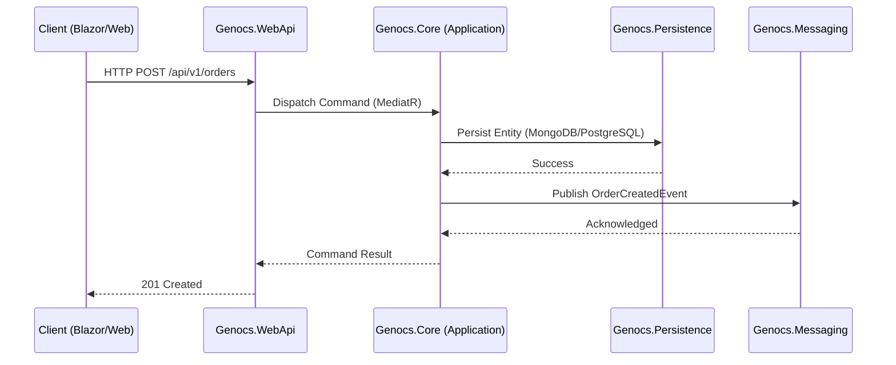

```mermaid
sequenceDiagram
    participant Client as Client (Blazor/Web)
    participant API as Genocs.WebApi
    participant Core as Genocs.Core (Application)
    participant DB as Genocs.Persistence
    participant Broker as Genocs.Messaging

    Client->>API: HTTP POST /api/v1/orders
    API->>Core: Dispatch Command (MediatR)
    Core->>DB: Persist Entity (MongoDB/PostgreSQL)
    DB-->>Core: Success
    Core->>Broker: Publish OrderCreatedEvent
    Broker-->>Core: Acknowledged
    Core-->>API: Command Result
    API-->>Client: 201 Created
```
