``` mermaid
architecture-beta
    group api(logos:aws-lambda)[Example]

    service webapp(logos:aws-cognito)[WebApp] in api
    service webapi(logos:aws-lambda)[WebApi] in api
    service db(logos:aws-documentdb)[Database] in api

    db:T -- B:webapi
    webapi:L -- R:webapp

```

## Introduction

The **Genocs CLI** (Command Line Interface) tool is a powerful and versatile command-line utility that enables developers to efficiently build, test, and run applications. It provides unified experience across different services inside your platform. It allows developers to create applications with ease. With its extensive set of commands, the Genocs CLI tool simplifies the development process by automating tasks such as project management, dependency resolution, and deployment. It is an essential tool for modern developers, offering productivity and scalability in application development.

**Genocs CLI** is the *dotnet tool* that allow you to use the Genocs templates. Genocs templates are dotnet template that will help you to setup quickly and easily services in your environment.

Genocs tool is based on [Microsoft-dotnet tools](https://learn.microsoft.com/en-us/dotnet/core/tools/global-tools).

## Supported runtime

Genocs CLI can be used on both .NET6|8|9.

---

## Visual Studio Integration

The Genocs CLI is integrated with Visual Studio. You can use the Genocs CLI to create, build, and run applications directly from Visual Studio. The Genocs CLI provides a unified experience across different platforms, allowing you to create cross-platform applications with ease. You can use the Genocs CLI to automate tasks such as project management, dependency resolution, and deployment. The Genocs CLI is an essential tool for modern developers, offering productivity, flexibility, and scalability in application development.



---

## How to install

To install the tool the only thing you must do is to take it from NuGet, install it into your global, that’s it.



``` bash
dotnet tool install -g genocs.cli
```

### Useful commands

``` bash
# Get the list of tools
dotnet tool list

# Get the list of templates
# Remember templates are the actual component that allows you to scaffold the service solution.
dotnet new list

# Install from nuget
dotnet tool install -g genocs.cli

# Update the tool
dotnet tool update -g genocs.cli

# Uninstall cache
dotnet tool uninstall -g genocs.cli
```

## Install templates

Genocs contains a bunch of templates that you can use to build a complete set of services from scratch.

The picture shows the console log upon the template is installed.



## The Templates

| Template        |      Command      |   CLI Command         |  To be used for                                 |
|:----------------|:------------------|:----------------------|------------------------------------------------:|
| angular         | gnx-angular       | **angular**           | angular front-end SPA                           |
| react           | gnx-react         | **react**             | react front-end SPA                             |
| blazor          | gnx-wasmblazor    | **blazor-wasm**       | web assembly - blazor portal                    |
| cleanblazor     | gnx-cleanblazor   | **blazor-clean**      | clean architecture - blazor portal              |
| webapi          | gnx-cleanwebapi   | **clean-webapi**      | onion clean architecture - WebAPI               |
| webapi          | gnx-microwebapi   | **micro-webapi**      | microservice multitenant - WebAPI               |
| webapi          | gnx-librawebapi   | **libra-webapi**      | microservice on top of Genocs Library - WebAPI  |


## Uninstall templates

To uninstall the templates, you can use the following command:

``` bash
# Get the templates list
dotnet new uninstall

# Follow the command line instruction
# or run the commands below
dotnet new uninstall Genocs.CleanArchitectureTemplate
dotnet new uninstall Genocs.WebApiTemplate
dotnet new uninstall Genocs.MicroserviceTemplate
dotnet new uninstall Genocs.Microservice.Template
```

### blazor

To create a blazor portal use one of these commands

``` bash
# To build a blazor portal 
genocs blazor-wasm new <Company.Project.Service>

# To build a clean architecture blazor portal 
genocs blazor-clean new <Company.Project.Service>
```

### WebAPI

``` bash
# To build a web api architecture webapi 
genocs libra-webapi new <Company.Project.Service>

# Another option to build a clean architecture webapi 
genocs clean-webapi new <Company.Project.Service>

# To build a microservice web Api with multitenant support
genocs micro-webapi <Company.Project.Service>
```

## The solution

You can find the solution on GitHub:

[genocs-library-cli](https://github.com/Genocs/genocs-library-cli)

You are free to fork or to clone it. Then you can update it at your own pace.

### Useful commands to work on your own

``` bash
# Build the project 
dotnet build ./src/genocs.cli.csproj

# Pack the tool (to be deployed on nuget) 
dotnet pack

# Run the tool to install the templates using the NET9 runtime
dotnet run -f net9.0 --project ./src/genocs.cli.csproj genocs -i

# Run the tool to install the templates (some as above with cd command)
cd ./src
dotnet run -f net9.0 genocs -i

# Install the tool from local folder to the global cache
dotnet tool install --global --add-source ./src/nupkg genocs.cli
```

## One in once

In the following section, you will find the commands to create a new service from scratch.
For sake of simplicity, we will change the name of the service from `<Company.Project.Service>` to a demo name.

``` bash
# To build a microservice web Api with multitenant support
genocs micro-webapi n Genocs.TestWebApi

# To build a blazor portal 
genocs blazor-wasm new Genocs.TestWebBlazorPortal

# To restore and build the services
dotnet restore ./Genocs.TestWebApi
dotnet build ./Genocs.TestWebApi

dotnet restore ./Genocs.TestWebBlazorPortal
dotnet build ./Genocs.TestWebBlazorPortal

# To run the API
dotnet run --project ./Genocs.TestWebApi/src/WebApi/WebApi.csproj

# Run following command into another terminal
dotnet run --project ./Genocs.TestWebBlazorPortal/src/Host/Host.csproj
```

