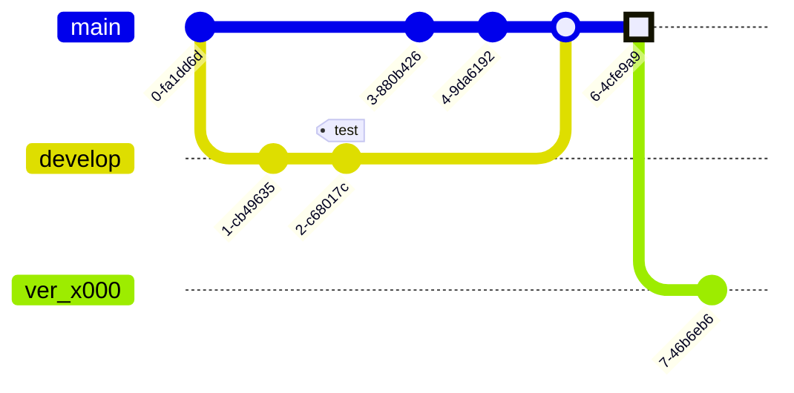

Genocs Library is **community-driven**. You can help with **libraries**, **documentation**, **templates**, **deployment examples**, or **sample applications**—choose the repository that fits.

## Repositories

| Focus | Repository |
| ----- | ---------- |
| Core .NET packages | [genocs-library](https://github.com/Genocs/genocs-library) |
| This documentation site | [genocs-library-docs](https://github.com/Genocs/genocs-library-docs) |
| Template packs | [genocs-library-templates](https://github.com/Genocs/genocs-library-templates) |
| Container / deployment examples | [enterprise-containers](https://github.com/Genocs/enterprise-containers) |
| Sample application | [genocs-basket](https://github.com/Genocs/genocs-basket) |
| Web API (clean architecture) template | [microservice-template](https://github.com/Genocs/microservice-template) |
| Blazor WebAssembly template | [blazor-template](https://github.com/Genocs/blazor-template) |
| Web API templates (collection) | [templates](https://github.com/Genocs/templates) |

**Roadmap:** [Angular](https://github.com/Genocs/angular-frontend-template) and [React](https://github.com/Genocs/react-frontend-template) front-end templates are planned; follow those repositories for updates.

## Contributing to this documentation

These steps apply to the **[genocs-library-docs](https://github.com/Genocs/genocs-library-docs)** repository.

1. Fork **genocs-library-docs** to your GitHub account.
2. `[Optional]` In your fork: **Settings → Secrets**, add **`GT_TOKEN`** with a [GitHub personal access token](https://github.com/settings/tokens) if your automation requires it.
3. Clone your fork locally.
4. Install [Node.js](https://nodejs.org/) and an editor (for example [Visual Studio Code](https://code.visualstudio.com/)).
5. From the repository root, run `npm install`.
6. Write content in **Markdown** under `content/en/`. Use [templating getting started](https://github.com/Genocs/genocs-library-docs/blob/main/content/en/templating/general/getting-started/index.md) as a reference for layout, images, and snippets.
7. Run the local site with `npm run start` and open `http://localhost:1313`.
8. Open a **pull request** to the upstream default branch.

Keep changes focused and avoid introducing avoidable build or lint issues.

## Contributors

Thanks to everyone who contributes. Below are GitHub contributor images for selected repositories (same data as each repo’s **Contributors** graph).

### Genocs Library (packages)

### Documentation (this site)

### Web API template

### Blazor template

### Templates (monorepo)

