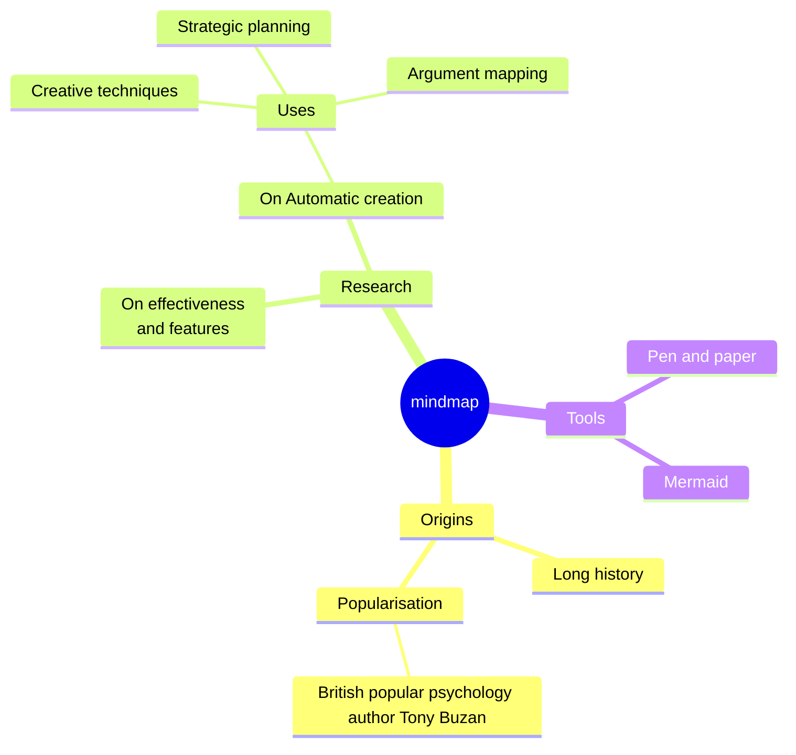

## What's Genocs's .NET Multitenancy Template?

Github Repository URI : [Genocs/dotnet-multitenancy-template](https://github.com/Genocs/microservice-template)

The template can be used with the `genocs cli`, `dotnet new` command or with the `Visual Studio 2022`, `Visual Studio Code` IDEs.

## Goals

The goal of this templete is to provide a complete and feature-rich starting point for any .NET Developer/Team to kick-start their next major project using .NET Microservices architecture. This also serves the purpose of learning advanced concepts and implementations such as `Multitenancy, CQRS, Onion Architecture, Clean Coding standards, Docker Concepts, Cloud Deployments with Terraform to AWS, CI/CD Pipelines & Workflows` and so on.

## Features

- :white_check_mark: Built on .NET10.0
- :white_check_mark: Follows Clean Architecture Principles
- :white_check_mark: Domain Driven Design
- :white_check_mark: Cloud Ready. Can be deployed to AWS Infrastructure as ECS Containers using Terraform
- :white_check_mark: Docker-Compose File Examples
- :white_check_mark: Well Documented
- :white_check_mark: Multi Tenancy Support with Finbuckle
  - :white_check_mark: Create Tenants with Multi Database / Shared Database Support
  - :white_check_mark: Activate / Deactivate Tenants on Demand
  - :white_check_mark: Upgrade Subscription of Tenants - Add More Validity Months to each tenant!
- :white_check_mark: Uses Entity Framework Core as DB Abstraction
- :white_check_mark: Supports MySQL, MSSQL, Oracle, PostgreSQL & SQLite
- :white_check_mark: Flexible Repository Pattern
- :white_check_mark: Dapper Integration for Optimal Performance
- :white_check_mark: Serilog Integration with various Sinks - File, SEQ, Kibana
- :white_check_mark: OpenAPI - Supports Client Service Generation
- :white_check_mark: Mapster Integration for Quicker Mapping
- :white_check_mark: API Versioning
- :white_check_mark: Response Caching - Distributed Caching + REDIS
- :white_check_mark: Fluent Validations
- :white_check_mark: Audit Logging
- :white_check_mark: Advanced User & Role Based Permission Management
- :white_check_mark: Code Analysis & StyleCop Integration with Rulesets
- :white_check_mark: JSON Based Localization with Caching
- :white_check_mark: Hangfire Support - Secured Dashboard
- :white_check_mark: File Storage Service
- :white_check_mark: Test Projects
- :white_check_mark: JWT & Azure AD Authentication
- :white_check_mark: MediatR - CQRS
- :white_check_mark: SignalR Notifications
- :white_check_mark: MassTransit Integration
- :white_check_mark: & Much More

## What's Genocs's .NET Microservice Template?

Github Repository URI : [Genocs/dotnet-microservice-template](https://github.com/Genocs/microservice-template)

`Star the above repository and support me!`